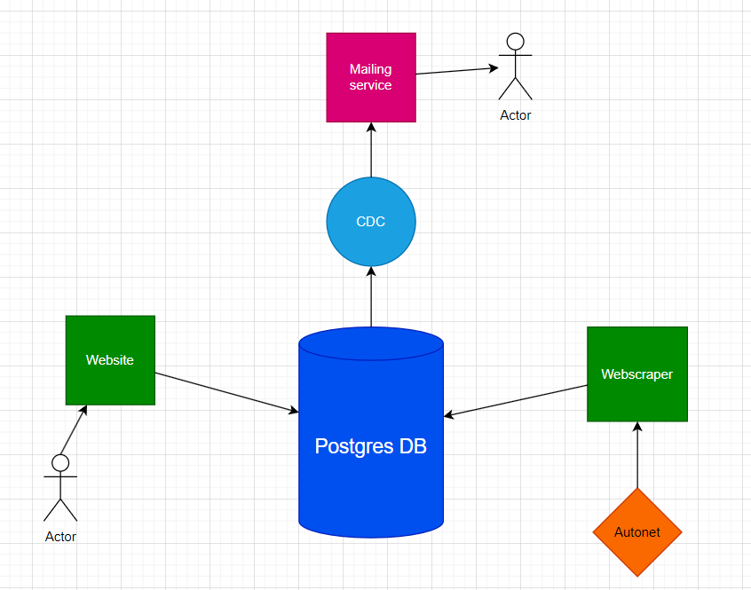

 

# Project description #
**dealHunter&reg;** is a web service designated for people, who want to buy a certain product (currently we support cars from slovenian website ***Avto.net***), but don't want to spend **to much time scrolling** through endless pages of what is avaliable on the internet. ****dealHunter**** provides a service, that enables users to filter what kind of product they need and after that **we take care of everything else.** Our users can just relax and wait for an email notification, signaling them it's time to buy their dream car, or maybe a house, who knows of **all the fields we could expand to.**
 
 
**Our mission** is to help people put their valuable time to better use, while at the same time not missing on great deals &rarr; ****dealHunter**** always hunts for them. We believe that our project offers **great scaling possibility,** as such service could be used across many **different parts of human endeavors,** for example searching for an apartment, buying a new TV or laptop...

# Code description #
**dealHunter's** architecture could be divided into four subcategories:

&nbsp;&nbsp;**&rarr;** **HTML&CSS user interface:**
 
&nbsp;&nbsp;&nbsp;&nbsp;&nbsp;&nbsp;&nbsp;****dealHunter's**** user interface is in a website form, written from stratch using _HTML_ and _CSS_. It has quite a retro style **&rarr;** you could sense that we come from FMF from afar. Webpage is divided into a welcome page, an empty _"Nepremičnine"_ page and a fully working _"Avtonet"_ page. The latter enables user to set parameters for the notifications they wish to receive 
&nbsp;&nbsp;**&rarr;** **PostgreSQL database:** 
 
PostgreSQL is the center of our operation. All data handling goes through it. It receives the data about car advertisements from the webscraper and the data about what notifications users would like. From there the data is handed on to our change detection service
&nbsp;&nbsp;**&rarr;** **Python webscraper:**
 
&nbsp;&nbsp;&nbsp;&nbsp;&nbsp;&nbsp;&nbsp;Code file ****webscraper/main.py**** consists of 2 classes: ModelGetter scrapes all car brands and corresponding models using selenium library. It goes through all of the models for each brand by clicking on the dropdown menu.  
&nbsp;&nbsp;&nbsp;&nbsp;&nbsp;&nbsp;&nbsp;AdScraper has a function _search_ads_ that uses Beautiful Soup library to scrape latest 100 ads and Zenrows library to avoid anti-bot detection. It stores relevant information for each advertisement on the website to PostgreSQL database.
&nbsp;&nbsp;**&rarr;** **Flask back-end:**
 
We chose to use Flask as our backend framework, for it's lightweight and suitable for our project. It allows easy integration with the database and our frontend interface.

**Change detection service(CDC):**
 
Change detection service is our main interface between the PostgreSQL database and the user. It is seperated into two instances one for each table (one for notification data and the other for advertisements). It is then forwarded to the mailing service which is implemented via FastAPI. 

**Docker:**
 
For ease of deployment and adjustability to different enviroments our entire project is implement in docker containers 

# Architecture scheme
